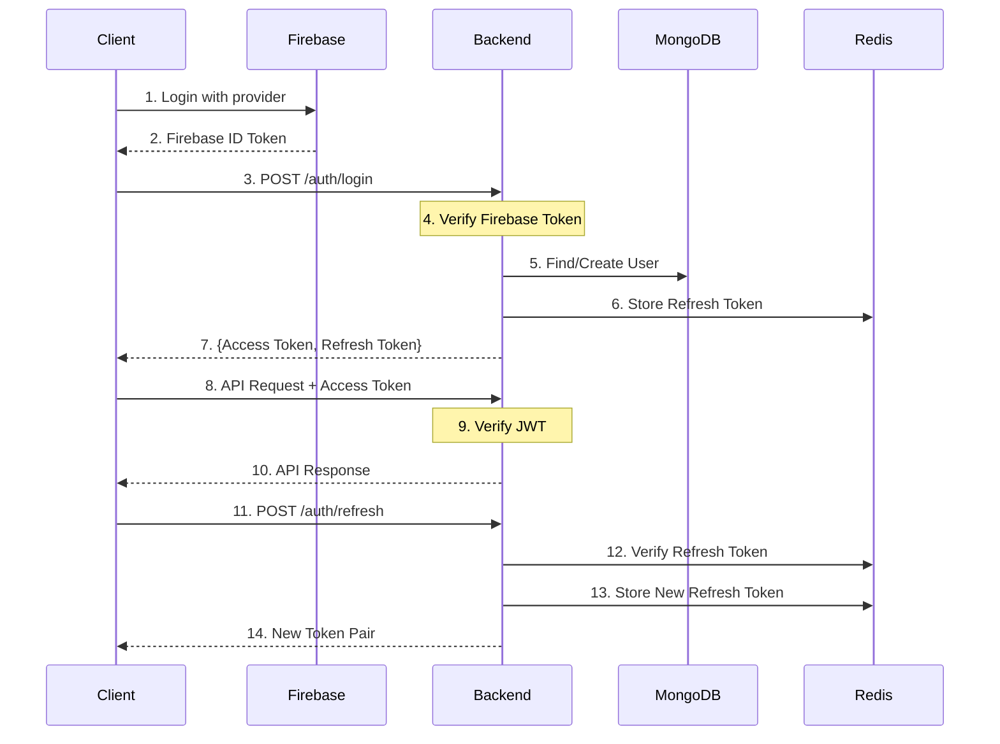

# Authentication System Documentation

## Overview

The authentication system is built on top of Firebase Authentication with custom JWT token management. It provides a secure, scalable, and flexible authentication solution that supports multiple authentication providers (Google, Apple, Email) while maintaining session management through JWT tokens.

## Architecture Diagram



## Authentication Flows

### 1. Login Flow

1. **Client-side Authentication**:
   - User authenticates with Firebase using their preferred provider (Google, Apple, Email)
   - Firebase returns an ID token

2. **Backend Authentication**:
   - Client sends Firebase ID token to `/auth/login`
   - Backend verifies the token with Firebase Admin SDK
   - Creates or updates user in MongoDB
   - Generates JWT token pair (access + refresh)
   - Stores refresh token in Redis
   - Returns tokens to client

### 2. API Request Flow

1. **Request**:
   - Client includes access token in Authorization header
   - Format: `Bearer <access_token>`

2. **Validation**:
   - Backend validates JWT signature and expiration
   - Extracts user ID from token
   - Proceeds with request if valid

### 3. Token Refresh Flow

1. **Refresh Request**:
   - Client detects expired access token
   - Sends refresh token to `/auth/refresh`

2. **Token Generation**:
   - Backend validates refresh token
   - Checks if token exists in Redis
   - Generates new token pair
   - Updates Redis with new refresh token
   - Returns new tokens to client

### 4. Logout Flow

1. **Logout Request**:
   - Client sends refresh token to `/auth/logout`
   - Backend removes refresh token from Redis
   - Client discards tokens

## Token Details

### Access Token

```json
{
  "userId": "userId_here",
  "exp": 1640995200,
  "type": "access"
}
```

- **Purpose**: API authentication
- **Storage**: Client-side only
- **Lifetime**: 1 hour
- **Type**: JWT

### Refresh Token

```json
{
  "userId": "userId_here",
  "exp": 1643673600,
  "type": "refresh",
  "jti": "unique_token_id"
}
```

- **Purpose**: Obtain new access tokens
- **Storage**: Client-side and Redis
- **Lifetime**: 30 days
- **Type**: JWT
- **Features**: Can be revoked

## Security Considerations

1. **Token Security**:
   - Short-lived access tokens (1 hour)
   - Refresh tokens can be revoked
   - Tokens stored in Redis for validation
   - JTI (JWT ID) for refresh token tracking

2. **Firebase Integration**:
   - Delegated authentication to Firebase
   - Secure token verification
   - Support for multiple providers

3. **Data Storage**:
   - User data in MongoDB
   - Refresh tokens in Redis
   - No sensitive data in tokens

4. **Best Practices**:
   - HTTPS only
   - CORS configuration
   - Rate limiting
   - Token rotation
   - Secure cookie options

## API Endpoints

### Authentication

```
POST /api/auth/login
Request:
{
    "firebaseToken": "Firebase ID Token"
}
Response:
{
    "user": {
        "id": "userId",
        "email": "user@example.com",
        "firstName": "John",
        "lastName": "Doe",
        "photoUrl": "https://...",
        "provider": "google"
    },
    "accessToken": "JWT Access Token",
    "refreshToken": "JWT Refresh Token"
}
```

```
POST /api/auth/refresh
Request:
{
    "refreshToken": "JWT Refresh Token"
}
Response:
{
    "accessToken": "New JWT Access Token",
    "refreshToken": "New JWT Refresh Token"
}
```

```
POST /api/auth/logout
Request:
{
    "refreshToken": "JWT Refresh Token"
}
Response:
200 OK
```

## Error Handling

1. **Authentication Errors**:
   - Invalid token
   - Expired token
   - Revoked token
   - Invalid credentials

2. **HTTP Status Codes**:
   - 200: Success
   - 400: Bad Request
   - 401: Unauthorized
   - 403: Forbidden
   - 500: Internal Server Error

## Implementation Notes

1. **Firebase Setup**:
   - Requires Firebase Admin SDK credentials
   - Configure allowed authentication providers
   - Set up Firebase project

2. **Database Indexes**:
   - MongoDB: `firebase_uid` (unique)
   - MongoDB: `email` (unique)
   - Redis: refresh token keys

3. **Environment Variables**:
   ```
   FIREBASE_CREDENTIALS_PATH=
   JWT_SECRET=
   REFRESH_TOKEN_SECRET=
   ```

4. **Dependencies**:
   - `firebase.google.com/go/v4`
   - `github.com/golang-jwt/jwt/v5`
   - `github.com/redis/go-redis/v9`
