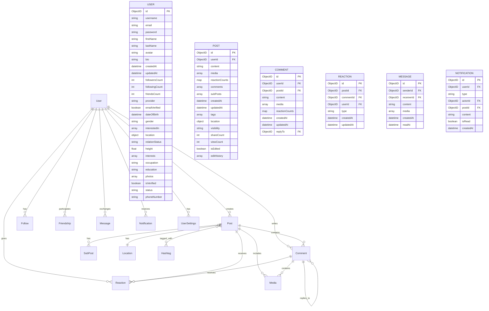

ผมจะช่วยแปลง Data Structure เป็น Mermaid ER Diagram ครับ:

ผมได้แสดงความสัมพันธ์หลักๆ ระหว่าง Entity ต่างๆ:

1. User เป็นศูนย์กลางที่เชื่อมโยงกับ Entity อื่นๆ
2. Post มีความสัมพันธ์กับ Comment, Reaction และ Media
3. Comment สามารถมี Reply (Self-referential)
4. แสดง Field หลักๆ ของแต่ละ Entity
5. ใช้สัญลักษณ์แสดงความสัมพันธ์:
   - ||--o{ : One-to-Many
   - }|--|| : One-to-One
   - }o--o{ : Many-to-Many

Diagram นี้จะช่วยให้เห็นภาพรวมของระบบและความสัมพันธ์ระหว่าง Entity ต่างๆ ได้ชัดเจนขึ้นครับ