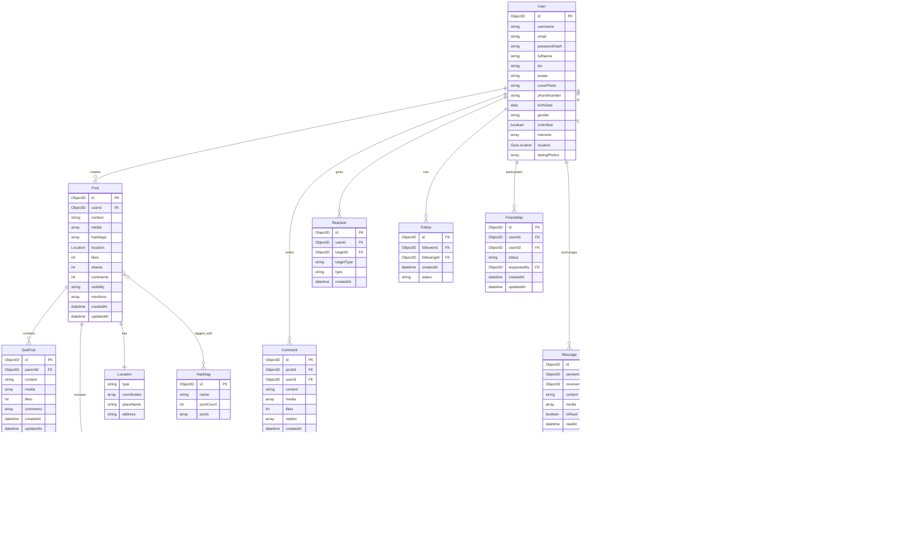

ยังไม่ครบในคำตอบเดียวครับ ผมจะรวมทุก Entity ให้ครบในคำตอบเดียว:

ตอนนี้ครบทุก Entity และความสัมพันธ์ในคำตอบเดียวแล้วครับ ประกอบด้วย:
1. User
2. Post
3. Comment
4. Reaction
5. Message
6. Notification
7. BaseModel
8. Follow
9. Friendship
10. GeoLocation
11. SubPost
12. Media
13. Location
14. Hashtag
15. UserSettings
16. DatingPhoto

พร้อมความสัมพันธ์ระหว่าง Entity ทั้งหมดครับ